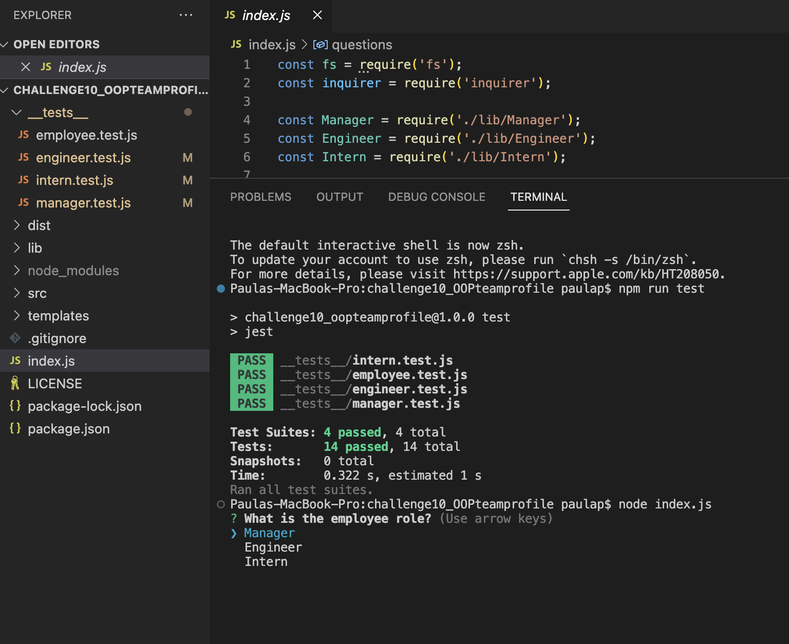

# Module 10 Challenge:Object-Oriented Programming Team Profile Generator
   

## Description

Using node.js command-line application, npm, inquirer and jest, a HTML team profile page is generated. 

Walkthrough Video:
https://youtu.be/NFW0VuU_F_8

## Installation
You will need to have Node.js installed on your computer.
You will need to clone the starter code from the project repository.
You will need to make sure you are in the main directory of the project folder.
You will need to install npm packages needed.

 install 
 - npm init -y
 - npm i 

 then install 
 - npm i inquirer 
 - mpm i jest 
 - npm run test 
 - node index.js  in command line project directory

## Usage
For a manager to quickly access email and github profiles of their team.

The following video shows an example of the application being used from the command line and test being run: https://youtu.be/NFW0VuU_F_8

## Acceptance Criteria
GIVEN a command-line application that accepts user input:

WHEN  **the user is prompted for my team members and their information**
THEN an **HTML file is generated that displays a nicely formatted team roster based on user input**

WHEN  the **user click on an email address in the HTML,**
THEN **the default email program opens and populates the TO field of the email with the address.**

WHEN  **click on the GitHub username,**
THEN that **GitHub profile opens in a new tab.**

WHEN the user **start the application,**
THEN  **prompted to enter the team manager’s name, employee ID, email address, and office number.**

WHEN  the user **enter the team manager’s name, employee ID, email address, and office number,**
THEN  **presented with a menu with the option to add an engineer or an intern or to finish building my team.**

WHEN the user **select the engineer option,**
THEN  **prompted to enter the engineer’s name, ID, email, and GitHub username, and I am taken back to the menu.**

WHEN the user **select the intern option,**
THEN **prompted to enter the intern’s name, ID, email, and school, and I am taken back to the menu.**

WHEN the user **decide to finish building my team,**
THEN **exit the application, and the HTML is generated.**

## Assets
These are images of the working application: Start of Jest Test, prompts for application, and final generated team profile page.

## Contributions/Licenses/Links
Github Proile: https://github.com/pppreap/challenge10_OOPteamprofile Walkthrough Video:
https://youtu.be/NFW0VuU_F_8

## Licenses

 
This application is covered by the MIT license. 

## Credits
MSU Coding Boot Camp

## Tests
Jest
- npm run test 

## Badges

## Questions
Any question Contact Me : 
Github Username: https://github.com/pppreap  
Contact Email: pppreap@icloud.com
